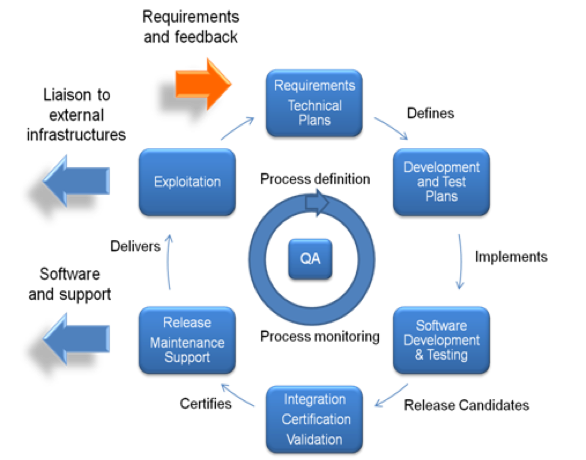
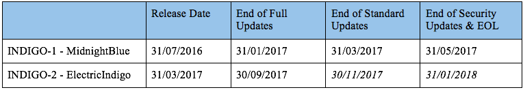

# INDIGO - DataCloud Software Releases

        
INDIGO - DataCloud delivers open source software components tailored to scientific communities and to e-infrastructures, aimed to increase ease of use and effectiveness in the exploitation of Cloud resources.

INDIGO - DataCloud releases are available from the [INDIGO-DC Repositories](http://repo.indigo-datacloud.eu).

The maintenance and development cycle of the INDIGO-DataCloud Core Services and Applications  is outlined in the figure bellow. 

 

## Major Releases

Taking into consideration the length of the project, the rapidly evolving cloud-environment, the need to offer stability to production infrastructures and in the same time to address requirements from user communities, the INDIGO-DataCloud major releases will be supported and maintained for **10 months** after the release date. The availability of a new major release of INDIGO-DataCloud does not automatically obsolete the previous ones and multiple major releases may be supported at the same time according to their negotiated end-of-life policies. Within an INDIGO-DataCloud major release only the latest version of a component is supported.

Taking into account the rapidly changing environment, and especially some of the upstream release cycles (e.g. OpenStack), the INDIGO-DataCloud maintenance schedule is organised in the following periods:
* **Full maintenance** period: during this period updates are released to address issues in the code and provide new features for each supported INDIGO-DataCloud major release (**6 months**)
* **Standard maintenance** period: during this period updates are released to address issues in the code, but no new feature is introduced, for each supported INDIGO-DataCloud major release (**2 months**)
* **Security updates** period: during this period only updates targeting security vulnerabilities are provided for each supported INDIGO-DataCloud major release (**2 months**)
* **End-of-life period**: in this period no updates or support are provided. The end-of-life period starts after the end of the security updates period

## Repositories

INDIGO DataCloud releases are available from the official [INDIGO - DataCloud Repositories](http://repo.indigo-datacloud.eu), for operating systems packages and Docker containers.

## Release Announcements

Stay updated subscribing to the [INDIGO - DataCloud RSS release feed](http://repo.indigo-datacloud.eu/INDIGODataCloudNews.rss.xml)  or by subscribing to the [INDIGO - DataCloud Announces Mailing List](https://lists.indigo-datacloud.eu/sympa/info/indigo-announce). 
