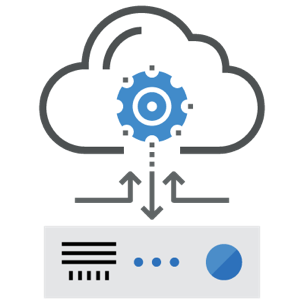

# INDIGO-2 ElectricIndigo

The [INDIGO-DataCloud](https://www.indigo-datacloud.eu/) is delighted to announce ElectricIndigo, the second and final major release of the project,. ElectricIndigo will be presented and demonstrated through several use cases at the [INDIGO Summit 2017, 9-12/5/2017](https://www.indigo-datacloud.eu/news/indigo-summit-2017-9-12-may-2017-catania-italy).
 
**ElectricIndigo** builds and expands on the first version of the software generated  by the project, called MidnightBlue, In this respect, it enhances  **stability**, adding more **programmability, scalability, automation and flexible network management**, to help resource providers and scientific communities address challenging problems and deliver new services.

<table> 
<tr><td></td>
<td><b>Application-level Interfaces for Cloud Providers and Automated Service Composition</b> Easily port applications to public and private Clouds using open programmable interfaces, user-level containers, and standards-based languages to automate definition, composition and instantiation of complex set-ups.</td>
</tr>
<tr><td><b>Flexible Identity and Access Management</b> 
Manage access and policies to distributed resources using multiple methods such as OpenID-Connect, SAML, X.509 digital certificates, through programmable interfaces and web front-ends.</td>
<td></td>
</tr>
<tr><td>
</td>
<td><b>Data Management and Data Analytics Solutions</b> 
Distribute and access data through multiple providers via virtual file systems and automated replication and caching, exploiting scalable, high-performance data mining and analytics.
</td>
</tr>
<tr><td><b>Programmable Web Portals, Mobile Applications</b> 
Create and interface web portals or mobile apps, exploiting distributed data as well as compute resources located in public and private Cloud infrastructures.
</td>
<td></td>
</tr>
<tr><td>
</td>
<td><b>Enhanced and Scalable Services for Data Centers and Resource Providers</b> 
Increase the efficiency of existing Cloud infrastructures based on OpenStack or OpenNebula through advanced scheduling, flexible cloud / batch management, network orchestration and interfacing of high-level Cloud services to existing storage systems.
</td>
</tr>
</table>

**New to ElectricIndigo:**
 
**ElectricIndigo** includes more than 40 modular components, distributed via 170 software packages and 50 ready-to-use Docker containers, adding the following new features to the previous INDIGO release:
* FairShare Scheduler for OpenNebula
* Network Orchestrator Wrapper (NOW) for Intra-site Networking Management in OpenNebula 
* Command Line Interface for submitting TOSCA Templates to the INDIGO PaaS
 
All the ElectricIndigo components support the CentOS 7 and Ubuntu 16.04 operating systems, as well as open source Cloud management frameworks such as OpenStack Newton and OpenNebula 5.X.
 

